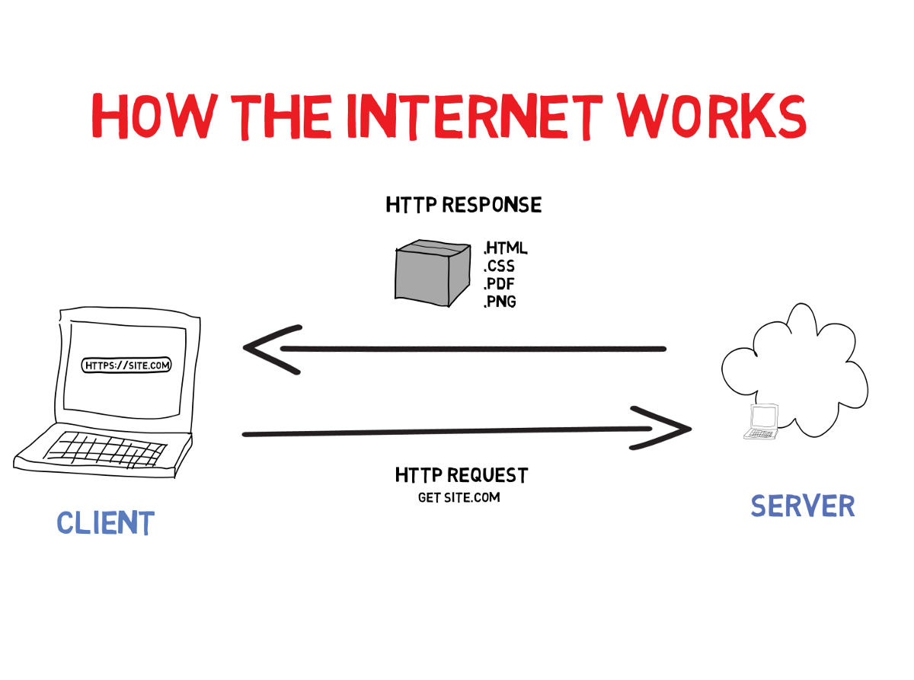

# Spike 1 notes

As explained on the LMS - the Internet is an **INTER**connected **NET** of computers. **Servers** hold information, and **client** computers (ie. private computers like ours) can make requests to a server for documents that are then displayed in a browser:
  

## HTML

HTML = **Hyper Text Markup Language**

In a new index.html file, use **!** shortcut to boilerplate. It is best practise for the **landing page** of your application to be called "index". This tells the browser where to start. The index.html should also always be in the root folder of your project.

- `<head>` tag holds:

  - `<title>` holds the title of the page, will also help with SEO (search engine optimization) This is what you see in the tab at the top.
  - `<style>` can be used to define styles for an html page. Best practise, however, is to link an external CSS document.
  - `<script>` holds client-side JavaScript, but it is better to put the JS scripts at the end of the body. This ensures all hard-coded HTML is already mounted before the script starts running.
  - `<link>` links two documents, or links an external source. Most commonly used to link to the CSS stylesheet - type **link:css** to boilerplate.
  - `<meta>` specifies the **character set** (how the computer reads the text), **viewport** settings (how the browser displays the document on your device screen), **page description**, **keywords** and **author** of the document (also relevant for SEO).

- The `<body>` holds all our actual website content.

HTML tags open and close with angled brackets. A single element will usually have an opening and closing tag - closing tag indicated with a forward slash before the element name. eg:

  ```html
  <p>paragraph content</p>
  ```

Some select HTML elements are self-closing, usually because they hold no content and so two seperate tags are redundant. eg:

  ```html
  
  ```

Many elements will have **attributes** that can modify their look, functionality, or behaviour - **class**, **type**, **src**, etc. These are always in the opening tag.

`<div>` and `<span>` are like boxes that hold other elements. The only difference is positioning: `<div>` default to **block**, while `<span>` default to **inline**. There are other more [semantic](https://www.w3schools.com/html/html5_semantic_elements.asp) HTML elements that we recommend you use when appropriate: `<nav>`, `<header>`, `<footer>`, etc. This makes it easier to identify sections in your code.

Other elements can be **nested**, such as `<li>` inside `<ul>`. However there are some rules and best-practices that should be followed (eg. `<p>` cannot hold a `<div>`). An [HTML validator](https://validator.w3.org/) will help to prevent these mistakes.

Dev tools/Inspector can be opened in a browser by right-clicking and selecting **inspect**, or with keyboard shortcuts <kbd>Ctrl</kbd> + <kbd>Shift</kbd> + <kbd>i</kbd> for Windows, or <kbd>command</kbd> + <kbd>option</kbd> + <kbd>c</kbd> for Mac.

## CSS

**CSS** stands for Cascading Style Sheet, and can be linked in the head tag of an HTML document. For your first project, I recommend against using any CSS libraries so you can get to understand the basic ways HTML and CSS interact.

[**Selectors**](https://www.w3schools.com/css/css_selectors.asp) target the element/s to which the styles will be applied (multiple elements can take the same style specifications). Playing games like [CSS Diner](https://flukeout.github.io/) and [CSS Speedrun](https://css-speedrun.netlify.app/) is a fun way to get in some practise.

Commonly used:

  - selector = element by type
  - .selector = class
  - #selector = id
  - selector1, selector2 = multiple selectors can be seperated by a comma
  - selector1 > selector2 = all selector2 that are a direct child of a selector1
  - selector1 selector2 = all selector2 nested inside a selector1

**Pseudo-classes** can be added to selectors to specify that the styles only apply during a special state. Common examples are `:hover`, `:focus`, `:active`.

**Specificity** determines which selector is the most relevant to an element that has conflicting selectors (ie **classes** are more specific than **types**). **Inline styles** are always highest specificity.

**Curly braces** surround the style - a **property** that is to be modified, and the **value** of that modification. Property-value pairs must be seperated by a **semi-colon**. eg:

```css
selector {
  color: red;
  font-size: large;
}
```

Colours in CSS can be set using color: **keyword**, **hex code**, **rgb code**, or **rgba code**. The a in **rgba** refers to transparency. VSCode gives a small sample, which can be clicked to open a colour-picker tool! (Note 'color' is spelt with US English spelling).

Many HTML elements already have a **default** style, such as display, margin, or padding. This can be overwritten with your custom styles.

CSS **units** can be **relative** (rem, %, vw) or **absolute** (cm, mm, px). Relative values are safer to use for scalability purposes.

A single CSS file can be linked to multiple pages to apply consistent styles. To link two HTML pages together, use an `<a>` tag, with an `href` attribute that specifies the file to be linked. eg:

```html
<a href="two.html">Link to Page Two</a>
```

Your **folder structure** is up to you, but it is important to have some system in place to organise your files. Having a folder to hold all HTML, a seperate folder to hold all CSS, and a third folder for assets is one approach. Having a folder for each page and the relevant CSS and content is another. It's best to stick to all **lower-case** letters, and use **hyphens** (**-**) rather than spaces when naming your files and folders (we call this **kebab-case**!). 

- [Project kick-off](https://lms.codeacademyberlin.com/content/web/Module-1/Project-1/Sprint-1#epic2:projectkick-off)
